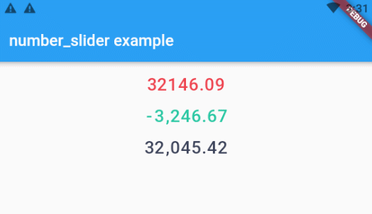

# number_slider

number_slider provides a digital slide display

## Installation

Add `number_slider: ^0.0.2` to `pubspec.yaml` dependencies. And import it:

```dart
import 'package:number_slider/number_slider.dart';
```

## How to use

Simply create a `NumberSlider` widget, and pass the required params:

```dart
NumberSliderController controller = NumberSliderController();

NumberSlider(
    controller: controller,
    initialNumber: '66,666.66',
    textStyle: TextStyle(
        color: Color(0xFFEC3944),
        fontSize: 22,
    )
)
```

When you want to change the number:
```dart
controller.number = '88,888.88';
```

Any symbol insertion is supported



## License

MIT